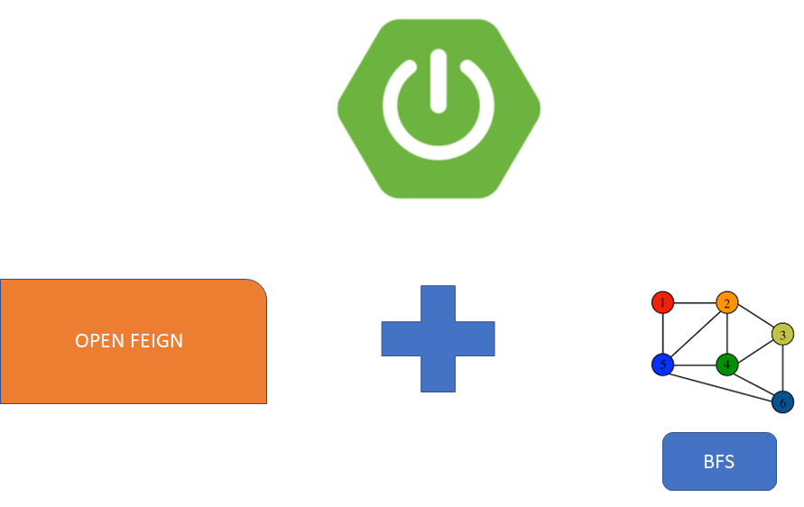

# Find the Shortest Path through Breadth First Search in Spring Boot  



### 📖 Information

<ul style="list-style-type:disc">
  <li>Breadth-First Search algorithm is a graph traversing technique, where you select a random initial node (source or root node) and start traversing the graph layer-wise in such a way that all the nodes and their respective children nodes are visited and explored</li>
  <li>Here is the explanation of the project
      <ul>
        <li>Find the shortest path between two countries cca3 code with respect to the resource defined below.</li>
        <li>Here is the resource link : https://mledoze.github.io/countries</li>
      </ul>
  </li>
</ul>

### Used Dependencies
* Core
    * Spring
        * Spring Boot
        * Spring Web
* Lombok
* Feign
* Docker

### 🔨 Run the App

#### Maven

<b>1 )</b> Download your project from this link shown below
```
    git clone https://github.com/Rapter1990/findshortestpathbfs
```

<b>2 )</b> Go to the project's home directory shown below
```
    cd findshortestpathbfs
```

<b>3 )</b> Create a jar file though this command shown below
```
    mvn clean install
```

<b>4 )</b> Run the project though this command shown below
```
    mvn spring-boot:run
```

#### Docker
<b>1 )</b> Build the image through Docker
```
    docker build -t findshortestpathbfs .
```
<b>2 )</b> Run the command
```
    docker run -p8080:8080 findshortestpathbfs
```


Explore Rest APIs
<table style="width:100%">
  <tr>
    <th>Method</th>
    <th>Url</th>
    <th>Description</th>
    <th>Valid Request Body</th>
    <th>Valid Request Params</th>
    <th>Valid Request Params and Body</th>
    <th>No Request or Params</th>
  </tr>
  <tr>
      <td>GET</td>
      <td>route</td>
      <td>Find the shortest path</td>
      <td><a href="README.md#route">Info</a></td>
      <td></td>
      <td></td>
      <td></td>
  </tr>
</table>


## Valid Request Body

##### <a id="route">Find the shortest path
```
    http://localhost:8080/route
    
    {
       "from": the cca3 code of the country
       "to": the cca3 code of the country
    }
```


### Screenshots

<details>
<summary>Click here to show the screenshots of project</summary>
    <p> Figure 1 </p>
    
</details>    